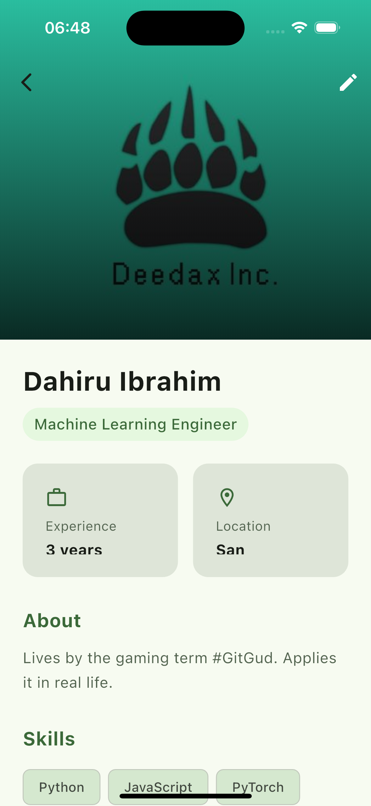

# Beam - Connect with Professionals Nearby

<p align="center">
  
</p>

## Overview

Beam is a location-based professional networking application built with Flutter and Firebase. It allows users to discover and connect with professionals in their vicinity, making networking seamless and location-aware.

## Features

- **Location-Based Discovery**: Find professionals within a customizable radius around your location
- **Beam Status Toggle**: Control your visibility to other professionals with a simple toggle
- **Professional Profiles**: View detailed profiles of nearby professionals including skills, bio, and contact information
- **Real-time Updates**: Get real-time updates on nearby professionals as they come in range
- **User Authentication**: Secure email verification system ensures authentic connections
- **WebRTC Video Calling**: Connect with professionals through high-quality video calls
- **Cross-Platform**: Runs on iOS, Android, and web platforms

## Screenshots

<p float="left">
  
  <!-- Add more screenshots here when available -->
</p>

## Tech Stack

- **Frontend**: Flutter (Dart)
- **Backend**: Firebase
  - Authentication
  - Firestore Database
  - Firebase Storage
- **Location Services**: Geolocator
- **Video Calling**: WebRTC with Firebase as signaling server

## Getting Started

### Prerequisites

- Flutter SDK (v3.7.2 or higher)
- Firebase project
- Android Studio / Xcode for mobile deployment

### Installation

1. Clone the repository
   ```
   git clone https://github.com/yourusername/beam.git
   cd beam
   ```

2. Install dependencies
   ```
   flutter pub get
   ```

3. Configure Firebase
   - Create a Firebase project at [Firebase Console](https://console.firebase.google.com/)
   - Configure Firebase for Flutter using the FlutterFire CLI
   - Update Firebase configuration files as needed

4. Create a `.env` file in the root directory with your API keys:
   ```
   BYTESCALE_ACCOUNT_ID=your_bytescale_account_id
   BYTESCALE_API_KEY=your_bytescale_api_key
   ```

5. Run the app
   ```
   flutter run
   ```

## Usage

1. **Sign up/Log in**: Create an account or log in with your email
2. **Verify Email**: Verify your email address through the verification link
3. **Update Profile**: Complete your professional profile with skills and bio
4. **Toggle Beam**: Activate the Beam feature to make yourself visible to nearby professionals
5. **Discover**: Browse through a list of professionals near you
6. **Connect**: View someone's profile and initiate a connection or video call

## Permissions

The app requires the following permissions:
- **Location**: To find professionals near you
- **Camera/Microphone**: For video calling functionality

## Contributing

Contributions are welcome! Please feel free to submit a Pull Request.

## License

This project is licensed under the MIT License - see the LICENSE file for details.

## Acknowledgements

- Flutter Team for the amazing framework
- Firebase for backend services
- All contributors who have helped shape this project
